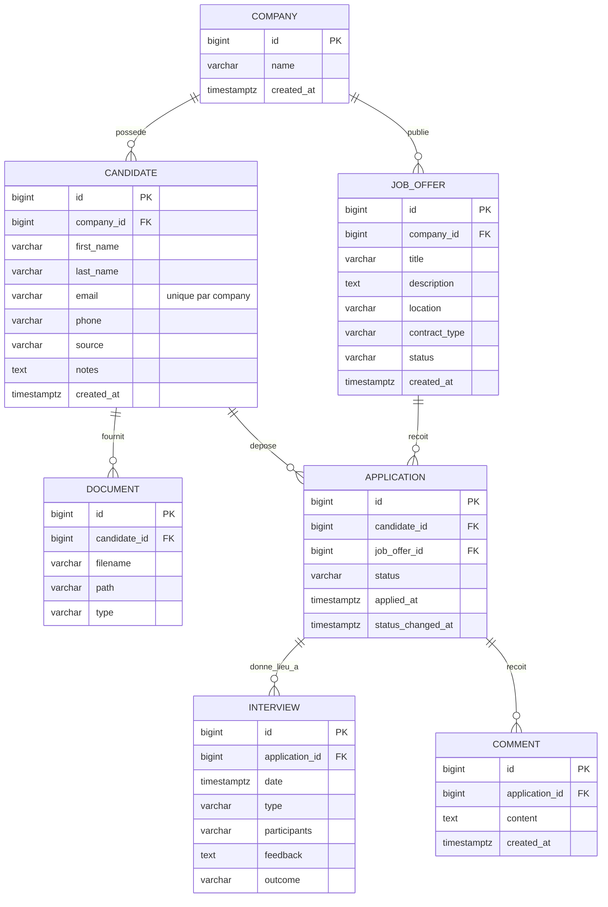

# Modèle métier

Ce document fige le modèle de données du MVP. Il sert de référence pour écrire les entités JPA au Jour 4 : tout ce qui n'y figure pas n'est pas à coder.

Voir aussi : [mvp.md](mvp.md), [cahier-des-charges.md](cahier-des-charges.md).

## Vue d'ensemble

Sept entités :

| Entité | Rôle | Table |
|--------|------|-------|
| Company | L'entreprise cliente | `companies` |
| Candidate | Une personne qui postule | `candidates` |
| JobOffer | Un poste à pourvoir | `job_offers` |
| Application | La candidature d'un candidat sur une offre | `applications` |
| Interview | Un entretien dans le cadre d'une candidature | `interviews` |
| Document | Un fichier appartenant à un candidat (CV, lettre…) | `documents` |
| Comment | Une note interne sur une candidature | `comments` |

L'idée centrale : le suivi du recrutement se fait sur la candidature (Application), pas sur le candidat. Un même candidat peut être en entretien pour un poste et refusé pour un autre au même moment.

## Conventions

Elles s'appliquent à toutes les entités.

- Identifiant : `id` de type `Long`, généré par la base (`BIGINT`, identity).
- Dates : type `Instant`, stocké en `TIMESTAMP WITH TIME ZONE`.
- Dates techniques : toutes les entités ont `createdAt` (renseigné à l'insertion, jamais modifié) et `updatedAt` (mis à jour à chaque modification). Elles ne sont pas répétées dans les tableaux ci-dessous : voir [architecture.md, section 12](architecture.md#12-timestamps-techniques). Les dates métier (`appliedAt`, `statusChangedAt`, `date` d'un entretien) sont des champs distincts, décrits entité par entité.
- Énumérations : stockées en texte (`VARCHAR`), jamais par position. Les valeurs sont en anglais dans le code et traduites dans l'interface.
- Clés étrangères : colonne `<entité>_id` (ex. `candidate_id`), toujours `NOT NULL`.
- Texte long : type `TEXT`. Texte court : `VARCHAR` avec la longueur indiquée.
- Toutes les chaînes sont nettoyées des espaces en début et fin avant enregistrement. Une chaîne vide est enregistrée comme `null` pour les champs facultatifs.

---

## Entités

### Company

L'entreprise qui utilise l'outil. Toutes les offres et tous les candidats lui appartiennent.

En V1 il n'y a qu'une seule entreprise, créée au démarrage de l'application, et aucune logique multi-entreprise (pas de filtrage, pas de connexion). La table existe pour que l'ajout de plusieurs entreprises plus tard ne demande pas de migration des données existantes.

| Attribut | Type Java | Colonne | Obligatoire | Contraintes |
|----------|-----------|---------|:-----------:|-------------|
| id | Long | `id BIGINT` | oui | clé primaire |
| name | String | `name VARCHAR(150)` | oui | non vide |
| createdAt | Instant | `created_at TIMESTAMPTZ` | oui | |

### Candidate

Une personne qui a postulé, ou qu'on a repérée, pour au moins un poste. La fiche contient ses coordonnées et des notes générales. Elle ne porte aucun statut de recrutement : celui-ci est sur chaque candidature.

| Attribut | Type Java | Colonne | Obligatoire | Contraintes |
|----------|-----------|---------|:-----------:|-------------|
| id | Long | `id BIGINT` | oui | clé primaire |
| firstName | String | `first_name VARCHAR(100)` | oui | non vide |
| lastName | String | `last_name VARCHAR(100)` | oui | non vide |
| email | String | `email VARCHAR(255)` | oui | format email valide, enregistré en minuscules, unique par entreprise |
| phone | String | `phone VARCHAR(30)` | non | format libre |
| source | CandidateSource | `source VARCHAR(30)` | non | voir valeurs ci-dessous |
| notes | String | `notes TEXT` | non | notes générales sur la personne, visibles uniquement en interne |
| createdAt | Instant | `created_at TIMESTAMPTZ` | oui | |
| company | Company | `company_id BIGINT` | oui | clé étrangère |

`CandidateSource` : par quel canal le candidat est arrivé.

| Valeur | Libellé |
|--------|---------|
| `EMAIL` | Email |
| `LINKEDIN` | LinkedIn |
| `JOB_BOARD` | Site d'emploi |
| `WEBSITE` | Site de l'entreprise |
| `REFERRAL` | Cooptation |
| `OTHER` | Autre |

Différence entre `notes` et Comment : `notes` concerne la personne en général (« préfère être contacté le soir »), un Comment concerne une candidature précise (« bon profil technique, salaire trop élevé pour ce poste »).

### JobOffer

Un poste que l'entreprise cherche à pourvoir.

| Attribut | Type Java | Colonne | Obligatoire | Contraintes |
|----------|-----------|---------|:-----------:|-------------|
| id | Long | `id BIGINT` | oui | clé primaire |
| title | String | `title VARCHAR(150)` | oui | non vide |
| description | String | `description TEXT` | non | |
| location | String | `location VARCHAR(150)` | non | lieu de travail, format libre (ex. « Casablanca », « Télétravail ») |
| contractType | ContractType | `contract_type VARCHAR(20)` | non | voir valeurs ci-dessous |
| status | JobOfferStatus | `status VARCHAR(20)` | oui | `DRAFT` à la création |
| createdAt | Instant | `created_at TIMESTAMPTZ` | oui | |
| company | Company | `company_id BIGINT` | oui | clé étrangère |

`ContractType` :

| Valeur | Libellé |
|--------|---------|
| `PERMANENT` | CDI |
| `FIXED_TERM` | CDD |
| `INTERNSHIP` | Stage |
| `FREELANCE` | Freelance |
| `OTHER` | Autre |

`JobOfferStatus` :

| Valeur | Libellé | Signification |
|--------|---------|---------------|
| `DRAFT` | Brouillon | En préparation, n'accepte pas encore de candidatures |
| `OPEN` | Ouverte | Accepte des candidatures |
| `CLOSED` | Clôturée | Recrutement terminé ou abandonné, plus de nouvelles candidatures |

Transitions autorisées : `DRAFT → OPEN`, `OPEN → CLOSED`, `CLOSED → OPEN` (réouverture). Une offre ne revient jamais en `DRAFT`.

### Application

La candidature d'un candidat sur une offre donnée. C'est l'entité de jointure entre Candidate et JobOffer, et c'est elle qui porte le statut de suivi du recrutement.

| Attribut | Type Java | Colonne | Obligatoire | Contraintes |
|----------|-----------|---------|:-----------:|-------------|
| id | Long | `id BIGINT` | oui | clé primaire |
| status | ApplicationStatus | `status VARCHAR(20)` | oui | `NEW` à la création |
| appliedAt | Instant | `applied_at TIMESTAMPTZ` | oui | date réelle de la candidature (ex. réception du CV). Par défaut, instant de création lu par le service ; modifiable ; jamais dans le futur |
| statusChangedAt | Instant | `status_changed_at TIMESTAMPTZ` | oui | date du dernier changement de statut. À la création, instant de création lu par le service |
| candidate | Candidate | `candidate_id BIGINT` | oui | clé étrangère |
| jobOffer | JobOffer | `job_offer_id BIGINT` | oui | clé étrangère |

Contrainte d'unicité : `(candidate_id, job_offer_id)`.

`ApplicationStatus` :

| Valeur | Libellé | Final |
|--------|---------|:-----:|
| `NEW` | Nouveau | |
| `SHORTLISTED` | Présélectionné | |
| `INTERVIEW` | Entretien | |
| `OFFER` | Offre | |
| `HIRED` | Embauché | oui |
| `REJECTED` | Refusé | oui |

Il n'y a pas de workflow imposé : on peut passer de n'importe quel statut à n'importe quel autre, y compris sortir d'un statut final pour corriger une erreur.

`appliedAt` et `createdAt` sont distincts : un recruteur saisit souvent une candidature après coup (CV reçu la semaine dernière, entré dans l'outil aujourd'hui). `appliedAt` donne la vraie date, qui sert à trier les candidatures par ancienneté et, plus tard, à mesurer le délai de recrutement. `createdAt` reste la date de saisie dans l'outil.

Ces valeurs par défaut sont posées par le service à partir d'une même lecture de l'horloge, juste avant l'enregistrement. Elles peuvent différer de quelques microsecondes de `createdAt`, posé par Hibernate : c'est accepté.

`statusChangedAt` est mis à jour par le serveur à chaque changement effectif de statut. Réenregistrer le même statut ne le modifie pas. Seul le dernier changement est conservé, pas l'historique.

### Interview

Un entretien organisé dans le cadre d'une candidature. Il est rattaché à Application et non à Candidate, parce qu'un entretien porte toujours sur un poste précis.

| Attribut | Type Java | Colonne | Obligatoire | Contraintes |
|----------|-----------|---------|:-----------:|-------------|
| id | Long | `id BIGINT` | oui | clé primaire |
| date | Instant | `date TIMESTAMPTZ` | oui | date et heure de l'entretien |
| type | InterviewType | `type VARCHAR(20)` | oui | voir valeurs ci-dessous |
| participants | String | `participants VARCHAR(500)` | non | noms des personnes présentes côté entreprise, séparés par des virgules. Texte libre, sans lien vers des utilisateurs |
| feedback | String | `feedback TEXT` | non | compte rendu libre, saisi après l'entretien |
| outcome | InterviewOutcome | `outcome VARCHAR(20)` | non à la planification, oui une fois l'entretien terminé | avis sur le candidat, voir valeurs et règle ci-dessous |
| application | Application | `application_id BIGINT` | oui | clé étrangère |

`InterviewType` :

| Valeur | Libellé |
|--------|---------|
| `PHONE` | Téléphone |
| `VIDEO` | Visio |
| `ONSITE` | Sur site |

`InterviewOutcome` : l'avis retenu à l'issue de l'entretien.

| Valeur | Libellé |
|--------|---------|
| `FAVORABLE` | Favorable |
| `RESERVED` | Réservé |
| `UNFAVORABLE` | Défavorable |

`outcome` et `feedback` sont indépendants : l'un est une catégorie qui sert à filtrer et à afficher, l'autre un texte libre qui détaille.

Un entretien est considéré comme terminé quand sa date est passée. La règle est la suivante :

- tant que la date est dans le futur, `outcome` doit rester vide ;
- dès que `feedback` est renseigné, `outcome` est obligatoire. Autrement dit, on ne peut pas enregistrer de compte rendu sans avis ;
- `outcome` peut être renseigné seul, sans `feedback`.

### Document

Un fichier appartenant à un candidat. Il est rattaché à Candidate et non à Application : un CV appartient à la personne et sert pour toutes ses candidatures.

En V1 on stocke le fichier et ses métadonnées, rien de plus. Le contenu n'est pas lu ni analysé.

| Attribut | Type Java | Colonne | Obligatoire | Contraintes |
|----------|-----------|---------|:-----------:|-------------|
| id | Long | `id BIGINT` | oui | clé primaire |
| filename | String | `filename VARCHAR(255)` | oui | nom d'origine du fichier, affiché à l'utilisateur |
| path | String | `path VARCHAR(500)` | oui | emplacement du fichier dans le stockage, généré par le serveur, unique, jamais exposé par l'API |
| type | DocumentType | `type VARCHAR(20)` | oui | voir valeurs ci-dessous |
| candidate | Candidate | `candidate_id BIGINT` | oui | clé étrangère |

`DocumentType` :

| Valeur | Libellé |
|--------|---------|
| `CV` | CV |
| `COVER_LETTER` | Lettre de motivation |
| `OTHER` | Autre |

### Comment

Une note interne écrite par le recruteur sur une candidature précise. Elle n'est jamais visible par le candidat.

Un commentaire n'a pas d'auteur en V1 : sans connexion, il n'y a pas d'utilisateur à qui l'attribuer.

| Attribut | Type Java | Colonne | Obligatoire | Contraintes |
|----------|-----------|---------|:-----------:|-------------|
| id | Long | `id BIGINT` | oui | clé primaire |
| content | String | `content TEXT` | oui | non vide |
| createdAt | Instant | `created_at TIMESTAMPTZ` | oui | |
| application | Application | `application_id BIGINT` | oui | clé étrangère |

Un commentaire ne se modifie pas : pour corriger, on le supprime et on en écrit un autre.

---

## Relations et règles métier

### Company 1 — * JobOffer

Une entreprise publie plusieurs offres. Une offre appartient à une seule entreprise.

- Une offre ne peut pas exister sans entreprise.
- Une offre ne change jamais d'entreprise.

### Company 1 — * Candidate

Une entreprise a sa propre base de candidats. Un candidat appartient à une seule entreprise.

- Un candidat ne peut pas exister sans entreprise.
- Deux candidats d'une même entreprise ne peuvent pas avoir le même email (comparaison sans tenir compte des majuscules). Si on tente de créer un doublon, l'API refuse et indique le candidat existant.
- Le même email peut exister dans deux entreprises différentes : ce sont deux fiches indépendantes.

### Candidate 1 — * Application et JobOffer 1 — * Application

Un candidat peut postuler à plusieurs offres, et une offre reçoit plusieurs candidats. Chaque couple candidat / offre donne au plus une candidature.

- Un candidat ne peut avoir qu'une seule candidature par offre, quel que soit son statut. Si un candidat refusé se représente sur le même poste, on rouvre sa candidature existante en changeant son statut au lieu d'en créer une seconde.
- Le candidat et l'offre d'une candidature appartiennent à la même entreprise.
- On ne peut créer une candidature que sur une offre `OPEN`.
- Quand une offre passe en `CLOSED`, ses candidatures restent consultables et leur statut peut encore être modifié (par exemple pour passer les derniers candidats en `REJECTED`).
- Une candidature ne change jamais de candidat ni d'offre. Pour corriger une erreur d'association, on la supprime et on en crée une autre.
- Une candidature peut être supprimée : ses entretiens et commentaires sont supprimés avec elle.

### Application 1 — * Interview

Une candidature peut donner lieu à plusieurs entretiens (premier entretien, entretien technique, rencontre avec la direction…). Un entretien appartient à une seule candidature.

- Créer un entretien ne modifie pas le statut de la candidature. C'est le recruteur qui décide de passer la candidature en `INTERVIEW`.
- On ne peut pas créer d'entretien sur une candidature `HIRED` ou `REJECTED`. Les entretiens déjà existants restent consultables.
- Le compte rendu (`feedback`) et l'avis (`outcome`) peuvent être ajoutés ou modifiés une fois la date de l'entretien passée, y compris après que la candidature est passée à un statut final.
- Saisir un avis ne modifie pas le statut de la candidature, même `UNFAVORABLE`.
- La date d'un entretien peut être dans le passé (saisie après coup).

### Application 1 — * Comment

Une candidature peut recevoir plusieurs commentaires. Un commentaire appartient à une seule candidature.

- Les commentaires sont affichés du plus récent au plus ancien.
- On peut commenter une candidature quel que soit son statut.

### Candidate 1 — * Document

Un candidat peut avoir plusieurs documents (plusieurs versions de CV, une lettre de motivation…). Un document appartient à un seul candidat.

- Formats acceptés : PDF uniquement en V1, 5 Mo maximum (voir DOC-01 du cahier des charges).
- Supprimer un document supprime aussi le fichier dans le stockage.

### Suppressions en cascade

| On supprime… | Effet |
|--------------|-------|
| Un candidat | Suppression de ses candidatures, de leurs entretiens et commentaires, de ses documents et des fichiers associés. C'est le droit à l'effacement. |
| Une offre | Refusé si l'offre a au moins une candidature. Il faut la clôturer à la place. |
| Une candidature | Suppression de ses entretiens et commentaires. |
| Un entretien, un commentaire, un document | Aucun effet sur les autres entités. |
| L'entreprise | Non prévu en V1. |

---

## Diagramme

---

## Hors modèle en V1

- User et Role : pas de connexion dans les Must Have. Ces entités arriveront avec S1 (voir points d'extension).
- Historique complet des changements de statut : seul le dernier changement est daté.

## Points d'extension futurs

Rien de ceci n'est à modéliser maintenant. Le tableau indique seulement où chaque brique viendra se brancher, pour vérifier que le modèle actuel ne bloque rien.

| Brique | Phase | Point d'accroche | Principe |
|--------|:-----:|------------------|----------|
| OCR et extraction de texte | 2 – 3 | Document | Le texte extrait d'un CV est stocké à côté du document (nouvelle table liée à Document, ou colonne). Le fichier d'origine reste inchangé. |
| Parsing de CV | 3 | Document → Candidate | Le résultat du parsing est une proposition de fiche candidat, validée par l'utilisateur avant d'écrire dans Candidate. On garde un lien vers le document source. |
| Matching et scoring | 4 | Application | Un score mesure l'adéquation entre un candidat et une offre, donc il porte sur le couple, c'est-à-dire la candidature. Il sera stocké dans une table liée à Application (score, critères, explication, date du calcul), jamais dans le statut. |
| Embeddings et base vectorielle | 4 | Candidate, JobOffer, Document | Les vecteurs sont calculés à partir du profil candidat, de la description d'offre ou du texte d'un CV. Ils sont stockés à part (extension pgvector de PostgreSQL ou base dédiée) et référencent l'id de l'entité d'origine. |
| Utilisateurs et connexion | S1 | Company, Comment, Interview | User et Role seront rattachés à Company. À ce moment-là : ajouter un auteur (`author_id` vers User) sur Comment, remplacer le texte libre `participants` d'Interview par une relation vers User, et, si besoin, un avis par participant en plus de l'avis global `outcome`. |
| RAG et assistant conversationnel | 5 | Company | L'assistant interroge les données d'une seule entreprise. Toute recherche est filtrée par `company_id`, d'où l'intérêt d'avoir Company dès la V1. |

Deux choix du modèle actuel rendent ces extensions possibles sans refonte : le statut est porté par Application (le scoring s'y accroche naturellement), et toutes les données remontent à une Company (l'isolement des données de l'assistant est déjà possible).
