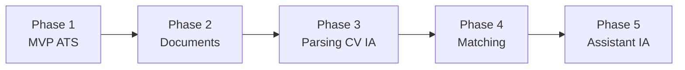

# Roadmap — Assistant RH

> Principe directeur : **résoudre d'abord un vrai problème métier, puis ajouter l'IA progressivement.**
> Chaque phase doit être utilisable et démontrable seule. On ne passe à la suivante qu'après validation par des utilisateurs.

---

## Vue d'ensemble

| Phase | Nom | Objectif | Complexité | Valeur métier | IA |
|-------|-----|----------|:----------:|:-------------:|:--:|
| 1 | MVP ATS simple | Centraliser et suivre les recrutements | Faible | Élevée | Non |
| 2 | Gestion documentaire | Stocker et consulter CV et documents | Faible à moyenne | Moyenne | Non |
| 3 | Parsing de CV par IA | Créer un candidat automatiquement à partir d'un CV | Moyenne | Élevée | Oui |
| 4 | Matching candidat ↔ offre | Classer les candidats pour une offre, avec explication | Élevée | Élevée | Oui |
| 5 | Assistant RH IA | Poser des questions en langage naturel sur ses recrutements | Élevée | Moyenne à élevée | Oui |

---

## Phase 1 — MVP ATS simple

**Objectif :** remplacer le couple boîte mail + Excel. Détail des exigences dans le [cahier des charges](cahier-des-charges.md).

**Fonctionnalités :** offres, candidats, candidatures avec suivi de statut, tableau de bord, fiches détail. Ensuite, si le temps le permet : connexion, entretiens, commentaires, recherche, plusieurs utilisateurs.

**Complexité :** faible. CRUD classique et règles métier simples.

**Valeur métier :** élevée. C'est le cœur du problème client, et la base de toutes les phases suivantes.

### Planning (8 jours)

| Jour | Thème | Livrable |
|------|-------|----------|
| 1 | Vision produit | `docs/mvp.md`, `docs/cahier-des-charges.md`, `docs/roadmap.md` |
| 2 | Conception métier | `docs/domain.md` : entités, attributs, relations, règles, diagramme Mermaid |
| 3 | Architecture technique | `docs/architecture.md` : frontend → API → PostgreSQL, puis place des futurs modules IA |
| 4 | Modèle de données | Entités JPA, énumérations, repositories, tests d'intégration contre PostgreSQL |
| 5 | Couche métier | Services, DTO, validation, mappers MapStruct, exceptions et gestionnaire d'erreurs, tests des règles métier |
| 6 | API REST et upload de CV | Controllers REST, Swagger, tableau de bord, stockage et upload des CV (PDF, 5 Mo), tests MockMvc |
| 7 | Frontend | Application web : tableau de bord, liste et détail des candidats (sans IA, design simple) |
| 8 | Démo interne | Scénario : tableau de bord (connexion si livrée) → offre → candidat → association → suivi |

Le planning initial prévoyait le frontend au Jour 6. Les Jours 4 et 5 ont été consacrés à un socle backend complet et testé (modèle de données puis couche métier), les controllers ont donc été regroupés au Jour 6 : le frontend démarre au Jour 7 sur une API stable et documentée, au lieu de simuler des données.

**Sortie de phase :** démo interne réussie, puis premières PME pilotes sur de vrais recrutements.

---

## Phase 2 — Gestion documentaire

**Objectif :** que le CV et les documents d'un candidat soient au même endroit que sa fiche.

**Fonctionnalités :**
- Upload de CV (PDF, DOCX) et d'autres pièces (lettre de motivation, diplômes).
- Consultation et téléchargement.
- Extraction du **texte brut** des PDF (sans IA). Ce texte servira à la Phase 3.
- Recherche plein texte simple dans les CV.

**Complexité :** faible à moyenne. Il faut choisir un stockage de fichiers (disque local puis stockage objet de type S3), limiter les tailles et vérifier les formats.

**Valeur métier :** moyenne. Utile au quotidien, et prérequis technique de la Phase 3.

**Prérequis :** Phase 1 en production chez les pilotes.

---

## Phase 3 — Parsing de CV par IA

**Objectif :** transformer un CV en fiche candidat pré-remplie, à relire et valider par l'utilisateur.

**Fonctionnalités :**
- OCR des CV scannés (PDF image).
- Extraction structurée : nom, prénom, email, téléphone, compétences, expériences, formations, certifications, langues.
- Écran de validation : l'utilisateur corrige avant d'enregistrer. **L'IA propose, l'humain décide.**

**Complexité :** moyenne. Appel à un modèle de langage via API, schéma de sortie structuré, gestion des erreurs et des coûts.

**Valeur métier :** élevée. C'est le premier « effet waouh » et un vrai gain de temps de saisie.

**Prérequis :**
- Phase 2 (extraction de texte).
- **Jeu de CV synthétiques** pour tester et mesurer la qualité d'extraction, sans données réelles.
- Validation juridique : traitement de données personnelles par un fournisseur d'IA externe (loi 09-08 / RGPD).

---

## Phase 4 — Matching candidat ↔ offre

**Objectif :** aider à trier les candidatures d'une offre.

**Fonctionnalités :**
- Score de correspondance entre un candidat et une offre.
- **Explication du score** : critères remplis ou manquants (compétences, expérience, langues).
- Tri des candidatures par score, sans rejet automatique.

**Complexité :** élevée. Il faut définir les critères, les évaluer et éviter les biais discriminatoires.

**Valeur métier :** élevée pour les offres qui reçoivent beaucoup de candidatures.

**Prérequis :**
- Données structurées issues de la Phase 3.
- Jeu d'évaluation (candidats et offres synthétiques avec le classement attendu).
- Règle produit : le score est une **aide à la décision**, jamais une décision automatique.

---

## Phase 5 — Assistant RH IA

**Objectif :** interroger ses données de recrutement en langage naturel et se faire aider sur les tâches rédactionnelles.

**Fonctionnalités (exemples) :**
- « Quels candidats en entretien cette semaine ? », « Où en est le poste de comptable ? »
- Rédaction assistée d'offres d'emploi.
- Génération de questions d'entretien adaptées au poste.
- Rédaction de réponses aux candidats (acceptation, refus).

**Complexité :** élevée. L'assistant doit accéder aux données de l'entreprise de manière sécurisée, sans jamais sortir de son espace.

**Valeur métier :** moyenne à élevée. C'est un argument commercial fort, mais qui n'a de sens qu'une fois les phases 1 à 4 adoptées.

---

## Règles de pilotage

1. **Pas de phase suivante sans utilisateurs sur la phase courante.** Les retours pilotes priment sur ce document.
2. **Données fictives uniquement** en développement, en test et en démonstration.
3. **L'IA reste optionnelle** : chaque fonctionnalité IA doit avoir une alternative manuelle.
4. Ce document est **revu à la fin de chaque phase**.
